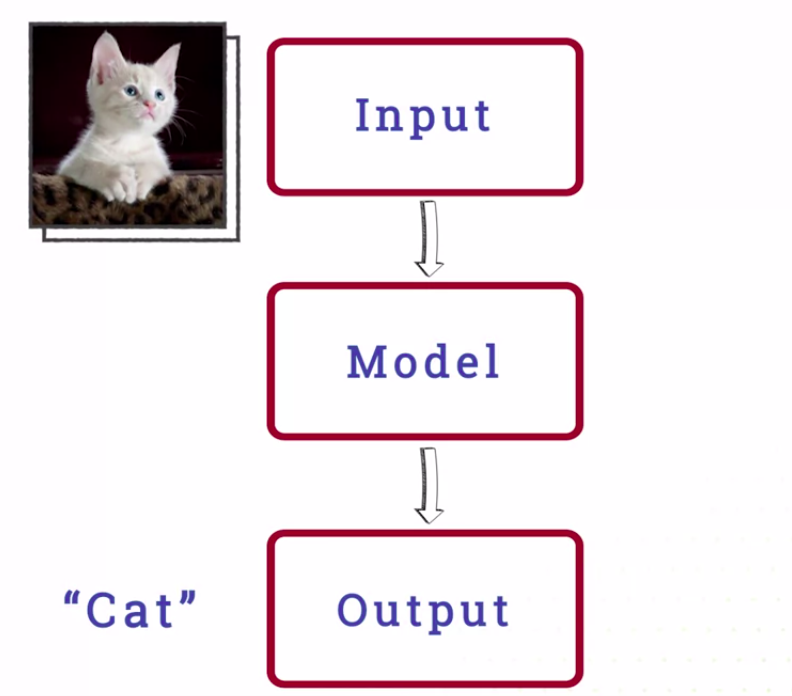
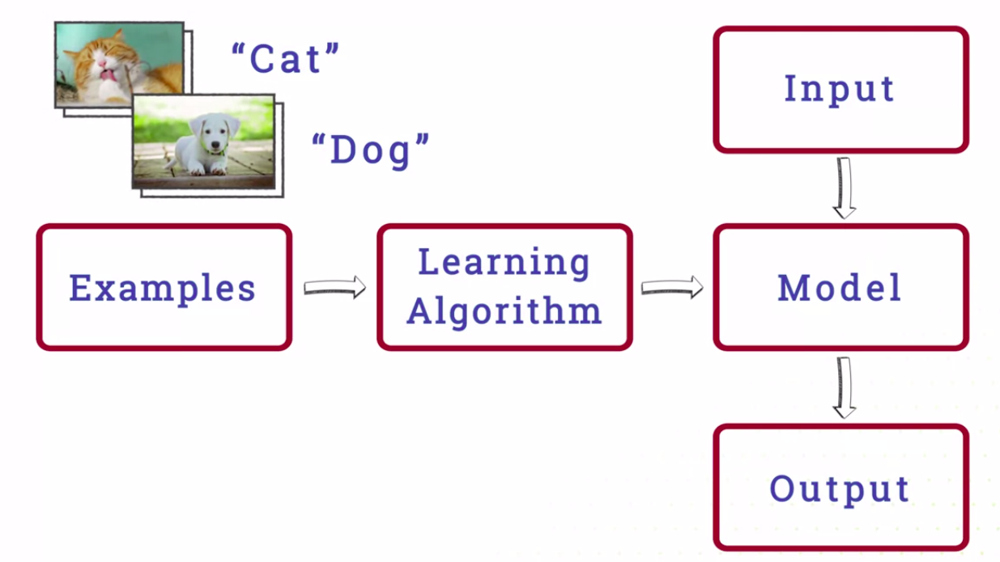
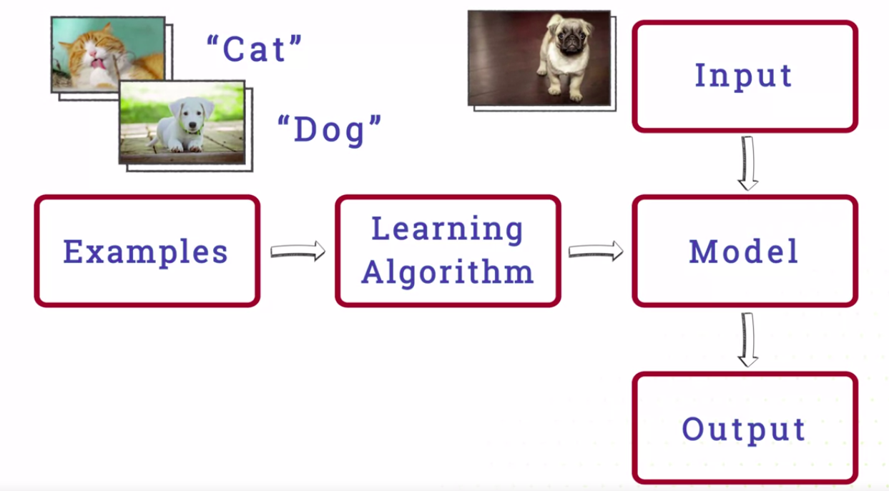

Machine Learning for All
========================

by University of London

# Module 1

#
## Title: Machine learning

## Lesson 1.0 Introduction

### Introduction: Computers that see

* Recognizing people's faces is something we humans do effortlessly, but how would you program a computer to recognize a person?
	* You could try to make a set of rules. For example, your friend has long black hair and brown eyes, but that could describe literally billions of people
* The truth is that we can recognize people without ever really knowing how we do it. We cannot describe every detail of how we recognize someone
* The trouble is that to program a computer, we need to break the task down into its little details
* That makes it very difficult or even impossible to program a computer to recognize faces
* Face recognition is an example of a task that people find very easy, but that is very very hard for computers
	* These tasks are often called __Artificial Intelligence__ or __AI__
* We are going to learn about the type of computing technique that can solve a lot of these AI problems and that's revolutionising what computers can do that technique is __Machine Learning__

## Lesson 1.1 Artificial intelligence

### Artificial intelligence

* Artificial intelligence is the area of Computer Science that tries to make machines that can replicate human intelligence
	* to do tasks that humans can do, but if historically been very difficult for machines
* On the other hand, tasks that almost any healthy human could do effortlessly are still incredibly difficult challenges for AI
	* Like picking up a glass of water without spilling it, or having a conversation about how your day was
* In fact, having an ordinary conversation is one of the classic AI challenges enshrined in the Turing test invented by Alan Turing
* Turing was not only one of the original inventors of the computer and responsible for breaking the Nazi codes in World War II
	* He also invented the basic ideas of AI
* There are many challenging areas of AI that aren't covered in the Turing test, like recognizing faces, manipulating physical objects or even driving cars
* In fact, AI is split into a wide wide of sub-fields that address particular challenges like 
	* Computer vision, computers that can see and understand
	* Natural language processing, computers that understand human language
	* Robotics and even computational creativity. Computers that can make creative works of arts
* Many of these sub-fields have resulted in computer systems that can do some incredibly useful things
	* Robots that can run factories
	* The Google search engine, which is based on sophisticated natural language processing
	* computers that can even diagnose diseases from looking at X-ray scans
* Building expert systems relied on experts knowing the rules they use to make decisions, but very often, they are subconscious, we don't quite know how we do things
	* This is one of the many reasons that most researchers started using a different approach called __machine learning__

## Lesson 1.2 Machine learning

### Machine learning

* Instead of programming a computer by telling it every detail of how to do a task, we teach it by giving it examples of what to do
* If we want the computer to tell the difference between cats and dogs, we can show it lots of pictures of cats and lots of pictures of dogs and it can learn to tell the difference
* Machine Learning uses statistical algorithms to learn from examples
* We call these examples data and we say that the computer learns from data
* These algorithms are often surprisingly simple but they can handle a lot of example data
* Simple algorithms can perform incredibly well if they have enough examples
* The most popular method of moment is deep neural networks, often called deep learning
* They're cutting edge methods but they aren't particularly new, neural networks were invented in the 1940s
* The methods used in deep learning are basically the same as those used in the 1980s
* Google's research director and AI pioneer, Peter Norvig, is quoted as saying, "We don't have better algorithms, we just have more data."
* __Machine Learning__
	* __Machine Learning__ is about creating statistical programs called __models__
	* A model takes an input and gives you back an output
	* The input could be a picture and the output could be the words cat or dog
				

				  
				

	* The model is created based on lots of example data
	* Each example includes both an input and an output
	* So it could be a picture of a cat together with the label cat or a picture of a dog with a labeled dog
	* A Machine Learning algorithm takes the examples and uses them to train the model
	* This means that they adapt the details of the model so that it maps the inputs in the example data to the corresponding outputs
		* So it maps the top image in the example data to cat and the bottom one to dog
				

				  
				

	* Once the model has been trained, you can give it new input, a picture without a label, and it will tell you the output
				

				  
				

	* The __input__ is just a bunch of numbers but anything that's represented on a computer is basically represented as a bunch of numbers
		* So the input can be almost anything you can represent in a computer, photographs, speech, music, web pages, bank accounts, social media profiles, DNA sequences, legal decisions, disease symptoms, news stories, astronomical data, or cute kitten videos
				

				  
				

	* Almost anything you do on a computer could have Machine Learning applied to it and the basic techniques are pretty much the same
	* The __outputs__ can also be lots of different things
		* In the most common type of Machine Learning, the output is one of a number of categories called __classes__
		* For example, cat, dog, or rabbit or for medical cases it could be the name of the disease or for face recognition it could be the name of the person who is recognized
* If the output is a number or several numbers like how serious a disease is, how emotional some music is, or how cute a kitten is we call it __regression__
* Machine Learning can create new images, music or synthetic speech in which case we call it a __generative model__
* Whenever we train a model on examples of input and output, we call it __supervised learning__
* Sometimes, we don't know what the right output is. This is very common in science, we might have a lot of DNA sequences and we want to know what different types exist. In this case, we might give the learning algorithm a set of inputs on their own and get it to figure out the categories, this is called __unsupervised learning__
* Rather than getting examples, __reinforcement learning__, works much more like training a dog
	* The algorithm does things and gets rewards for doing good things like a dog getting a treat and gets punishments for doing the wrong thing
	* This is great for playing games
		* The model gets rewards for winning games and punishment for loosing them
* __AlphaGo__, the software that build the world champion at the game go, used __reinforcement learning__ to learn which strategies were good based on whether it won or lost games
* There are many different approaches to Machine Learning but all of these different types of learning use statistical algorithms and data

### Machine learning algorithms

* Most machine learning algorithms are based on statistics and could be quite mathematical and complex
* For example, you have lots of pictures of cats and lots of pictures of dogs. You're given a new picture and have to decide if it's a cat or a dog. How can you do it?
	* One simple way of doing this is to look through all the original examples and find the one that's most similar to the new picture and use its class
		* It's a very simple method but can actually work quite well
		* In fact, it's an established algorithm with its own name __nearest neighbor__
			* It's called that because you're classifying a picture based on the nearest example, which we call its neighbor
		* It works as an algorithm, but it can be improved
			* For example, there are times when a dog picture might look a lot like a cat picture. In that case, the nearest neighbor will be wrong
		* We can never completely eliminate errors like that
		* __But one way we can reduce them is to use more than one neighbor__
	* We normally name the number of neighbors with the letter K and call the algorithm __K Nearest Neighbors__ or __KNN__
		* __One Nearest Neighbor__ is hardly ever used but __K Nearest Neighbors__ is actually a very commonly used machine learning algorithm
		* Another issue with nearest neighbor is what we mean by near or similar
			* The algorithm needs a mathematical definition of similarity that will give a number rating how similar two items are
			* For example, for pictures, you might measure how different each pixel is and add up all the results to get a score
		* A lot of the work of using nearest neighbors is about having a good measure of similarity which internally means having a good representation of pictures or whatever we are trying to classify
		* Another problem with nearest neighbors is that it can be slow, you have search through every single example to find the most similar
			* One solution is to select only a small number of important examples to compare with and throw the rest away
* __SVM__ or __Support Vector Machine__
	* Comparing with the small number of important examples together with a very sophisticated similarity measure and a bunch of other clever stuff is the basis of a method called Support Vector Machines
* Another approach is to not use the original examples directly, but to use them to create a mathematical function to do the classification. This function is called a __Model__
* We could classify all animals above a certain size as dogs and below that size as cats. This is a very simple mathematical function that can do classification, comparing size with a certain value that we call the threshold
	* How do we know what to use as a threshold? We can do it based on the data. We choose the value that gives us the smallest number of incorrect classifications
* __Optimization__ means choosing the numbers that we use in our models so that they give us the best results on the training data
	* In this case, we're choosing the threshold the size above which we classify animals as dogs
* Most machine learning algorithms that use some form of optimization
* One method called __Decision Trees__ combines many simple decisions on individual features
	* The algorithm performs one decision after another, choosing features to use based on the previous decision
	* It might first make a decision based on size and then split up the small animals based on ear shape
	* The features to use, the order in which they used, and the threshold values are all learned from data using optimization
* Algorithms like __neural networks__ combined many features together into complex mathematical functions and only make one decision based in the output of that function
	* The details of the function are also learned from data using optimization
* So most machine learning algorithms are based on combining together many features of the data into mathematical functions called __models__
* The details of these models are chosen automatically, so they give the best results on the training data, a process called __optimization__

