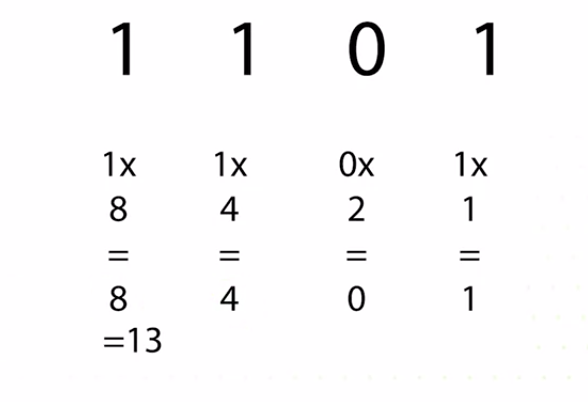
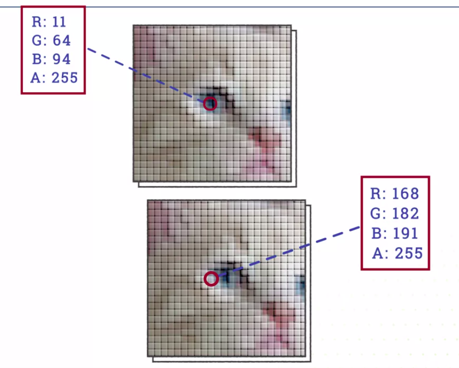
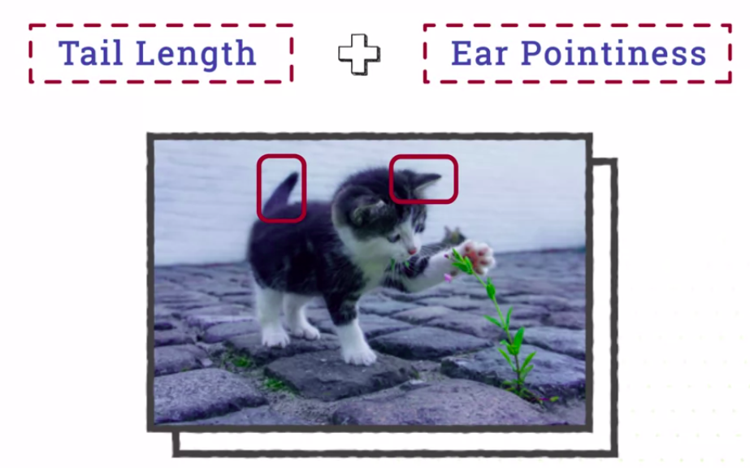
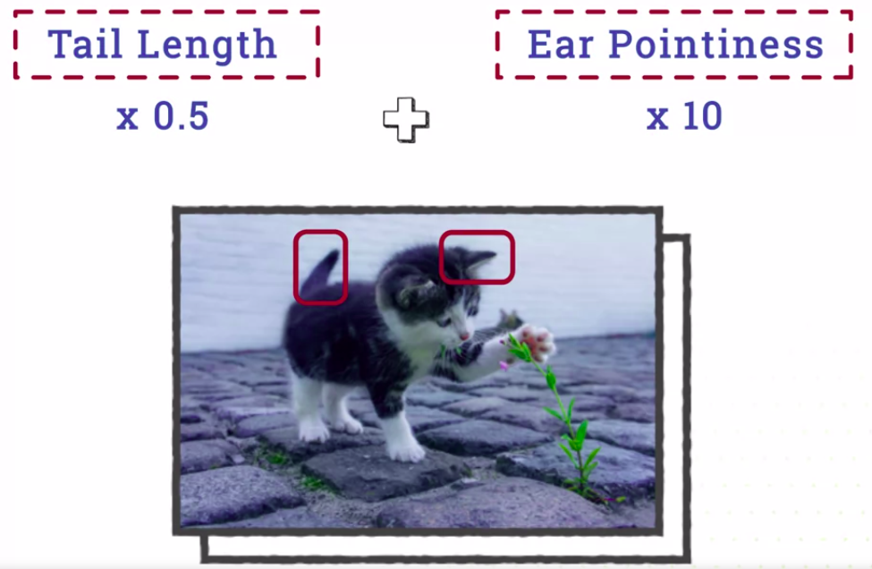
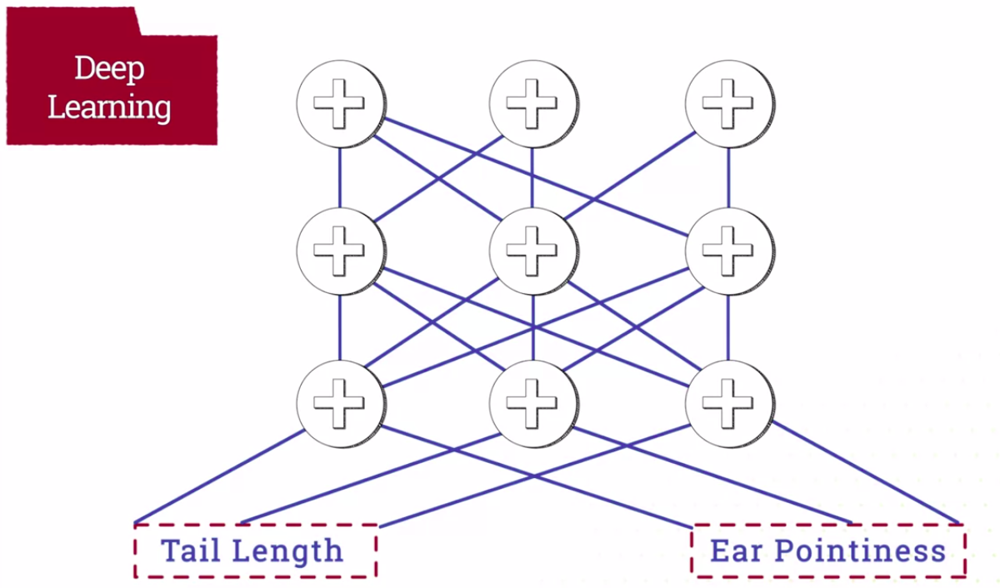
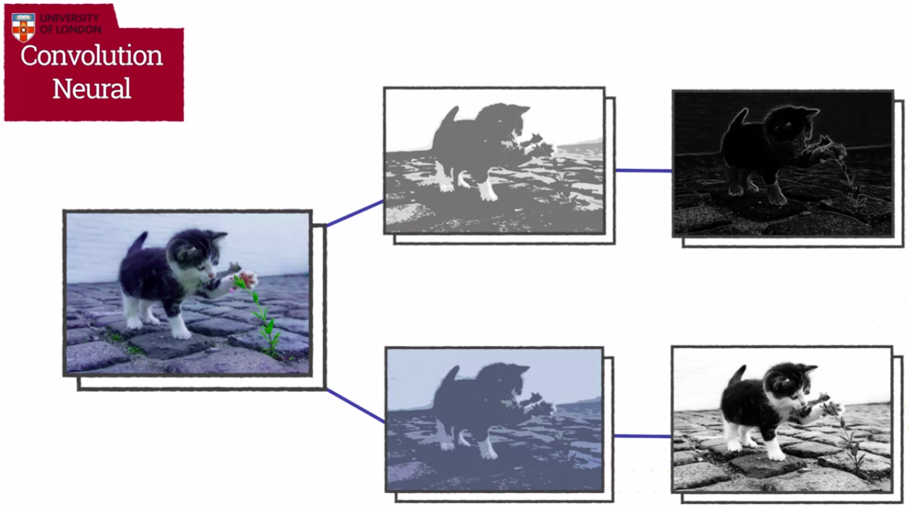

Machine Learning for All
========================

by University of London

# Module 2

#
## Title: Data Features

## Lesson 2.1 Data Representation

### The bit

* The most fundamental unit of digital information, the __bit__
* A __bit__ is something that can only have one of two states at any one time. One or Zero, On or off, black or white, true, false, yes, no, high-voltage, low-voltage, right, wrong, read, unread, locked, unlocked, win or lose
* A bit is very, very simple. But it's also very powerful, because it can represent many things
* A bit can be one or zero when it's dealing with numbers, black or white for pictures, or locked or unlocked for security features
* Some people might say that a bit is really high or low voltage, because that's how it's represented in physical memory
	* But the same bit of information might be represented differently when it's copied to a hard disk or DVD or transmitted over optic fibers
* A bit is an abstract representation that can represent any duality, any binary distinction between two things
	* Like anything on a computer, it's this abstraction that gives it its power
	* It isn't tied to any particular application. It can be used to represent almost anything
* Computer memory is typically measured in gigabytes
	* A byte is eight bits, and a gigabyte is a billion bytes
	* So, that's eight followed by nine zeros ( 8 000 000 000 )
* Modern hard disks can be measured in terabytes, which would be eight trillion bytes
* It's combining these bits together that allows us to represent many complex things
	* A single bit can represent black or white
	* But by putting together lots of black and white pixels, you can make a picture
* By combining a lot of bits together you can make numbers, letters, sounds, pictures, videos, and everything else that you can store on a computer

### Bytes and numbers

* Bits are great because they are very simple representation that can be used for many different types of data
	* But if you want to represent anything more complex, you need combine bits together
* On a modern computer, you almost never deal with individual bits. It's way too inefficient to try to access data at that level of single bits
	* Memory's always addressed in larger chunks
* One very commonly used chunk of memory is a __byte__
	* A __byte__ is __eight bits__
	* It's the standard measure of memory
	* We measure files in terms of kilobytes, megabytes, gigabytes, and terabytes
	* In fact, even a single byte is too small to access directly on a modern computer
* In a typical modern computer, the smallest element you can access is 64 bits or eight bytes
* That means, if we want a variable to represent just true or false, we still have to use 64 bits to store it
	* That sounds like it's very inefficient, but actually accessing data in 64 bit chunks speeds up the whole computer
	* So, it does turn out to be faster
* If you represent a bit as a one or a zero, a bite looks like shown in image below
				

				  
				

	* A byte can represent many
	* In fact, 256 different patterns of ones and zeros called __bit patterns__
		* Each pattern can represent something different
		* For example
			1. this pattern represents letter A
				

				  
				

			1. This pattern represents letter G
				* But any pattern could represent many different types of data. So, this pattern can also represent the number 71 or dark gray
					

					  
					

* __Numbers__ are really useful because you can use them to represent many other things
* In fact, we'll talk about representing everything else in terms of numbers
	* Some things like letters are represented in a way that you could think about in terms of bit patterns or numbers, but I just find numbers easier to read in bit patterns
* This is an example of using one abstraction bit patterns to build a high level one __numbers__, that's easy to work with for humans at least, and could be used to build other abstractions such as letters, images, and sounds
* How do we represent numbers?
	* Let's start by looking at how we represent numbers in the __Decimal System__
		* As an example, let's look at the number 3,168
			* The digit on the far right, eight is multiplied by one
			* The next digit, six is multiplied by 10
			* The one is multiplied by 10 times 10 or a 100
			* The digit on the left, three is multiplied by 10 times 10 times 10 or thousands
			* So, each place in a number represents a number 10 times larger than the previous one
					

					  
					

	* __Binary numbers__ work the same way, except instead of multiplying by 10, we use two
		* The right most number is multiplied by one, The next right most by two, Then two times two, four, two time two times two, eight
		* So, the binary number 1101 is starting from the right 
			* one times one, plus zero times two, plus one times four, plus one times eight that makes one plus zero plus four plus eight which is the decimal number 13
					

					  
					

* So, you can use binary notation to represent decimal numbers as a pattern of bits
* The important thing is that you can represent numbers as bits
* A single byte can represent numbers up to 255
	* But most computers represent numbers as either 32 bits or 64 which is either over four billion or over quintillion
* __Binary can also be used to represent negative or fractional numbers__

### Other types of data

* With numbers, we can create other types of data.
* One of the most common types of data using a computer is written text
* Text can be converted into a sequence of numbers by using a code where each letter corresponds to a number
	* For example, A is 65 and G is 71
* You could just as easily say that each letter corresponds to a bit pattern
	* A is 01000001, but I find it easier to think in numbers
	* The computer doesn't carry the weight
* The **A**merican **S**tandard **C**ode for **I**nformation **I**nterchange abbreviated to **ASCII** is a **standard** for representing texts that includes all of the letters in the English alphabet plus numbers and special characters in **seven bits**
	* That's great if you're writing in English
	* An __extended eight-bit version of ASCII__ includes the accents for European languages like __French__ or __German__
		* But that still doesn't help you if you want to represent Arabic, Bengali or Mandarin on a computer
* Since above mentioned shortcomings of ASCII excludes the vast majority of the world's population
	* ASCII is being replaced by a new standard called **Unicode** which can represent almost any writing system and, importantly, is extensible so other writing systems can be added
* It's an unfortunate legacy of the Western bias in computing technology that there's still a lot of computer systems that use ASCII but that's gradually fading
* A very large proportion of the data represented on a computer is a combination of text and numbers
	* For example
		1. a web page is mostly text with some numbers used for formatting, most spreadsheets and numbers with some text
		1. A corporate database will have texts for things like employee names and numbers for salaries and payroll numbers
* A modern picture is typically made out of millions of pixels
	* For example
		* an image that's a 1,024 pixels across by 1,024 pixels down would be over a million pixels in total, but it's still relatively low-resolution
		* Of course, we don't just want black and white pixels
			* The first improvement is to have varying shades of gray or brightness between black and white. We could do that by using numbers instead of a single bit
			* Because computer screens create colors using light, __high numbers__ values represent __bright colors__, more light, and __low number__ values represent __dark__, less light
				* Brightness is typically represented by eight bits
				* So, shades between black and white will be a number between 0 and 255
* To create color, we use three numbers, one for each primary color, red, green and blue often called RGB
	* By combining them, you can create any color that is visible to humans
	* We often add a fourth number to allow for transparent images
		* This number normally called __alpha represents opacity__, which is the opposite of transparency
			* So, an __alpha__ of __0__ means a __completely transparent__ pixel and __255__ is __completely opaque__, not transparent
* __Sound__ is also __represented__ in terms of __numbers__
	* A __sound__ is actually a __series__ of __microscopic changes in air pressure__ that is __picked__ up __by__ our __ears__
	* A __microphone__ can __record__ these __changes__ in __air pressure__ and convert them __into voltages__
	* To record audio in digital form, we can record the air pressure change as a number
	* To get realistic sound, we have to do this very fast, typically, over __44,000 times__ a second
	* One of these individual recordings is called a __sample__ and a __whole sequence__ of __samples__ becomes a __sound file__
* So, our very simple bits can be used to build up very complex data. A single number is tiny, only 32 or 64 bits. But images and audio can include millions of numbers
	* Since a video file is a long sequence of images, it can be very large, often several gigabytes
* Our large memory chips and hard disks can hold what seems like huge amounts of numbers, but with data like video, they can often fill up
	* So, it's very important to be aware of how data is being represented as it can directly affect the performance of your computer

## Lesson 2.2 Data features

### Data Features

* Machine Learning to anything that we can represent as numbers
* An image is a grid of pixels and each pixel is represented as numbers that represent colors
	* So that could be a good input to machine learning, but there are problems with it
		* Small changes to an image that we wouldn't even recognize as and real change can have a big impact on pixel values
		* Small change in lighting, can have big effects that we don't recognize because we're used to seeing objects in the different lighting conditions
		* Also shifting the whole image even a couple of pixels to the right, can completely change the value of a particular pixel, even though the image looks the same to us
		* This means that raw pixel values can be a bad representation of an image from machine learning
					

					  
					

* In machine learning, we use the name features for the numbers we use to represent things
	* Pixels are an example of a feature for images
		* They're what we call a __low-level__ or __raw data__ feature that represent the image as it is but individual pixels don't carry much meaningful information
		* If instead of using images of cats and dogs, we took measurements of things like nose length, weight and fur color, these will be __higher level__ more meaningful features which might work better for machine learning
	* The features we choose can have a big effect on learning
					

					  
					

	* It'll be possible to learn something using certain features, but it might be impossible to learn the same thing using other features
* Most domains have many different possible features
	* For example
		* A sound signal is a __low-level__ feature for both music and human language
			* but both have __high-level__ meaningful features like musical notes or written words
	* __Machine learning__ is likely to __work better__ with these __high level features__, but there are also many situations where we'd like to work directly with the raw data like images
					

					  
					

* It's possible to automatically calculate some features that are more meaningful than pixels from the real pixel data
	* For example
		* edges between patches of color are often a good feature and they can be calculated using the kind of filter that you might be familiar with from a photo editing software like Photoshop
					

					  
					

* Many face recognition systems have special code to recognize the eyes or the edges of the mouth
					

					  
					

* An important part of the process of machine learning is feature extraction, extracting more meaningful features from the raw data
	* This generally means writing some custom code to calculate these features
	* It's now increasingly possible to learn the features themselves

### Neural Networks

> **Deep Learning** means having networks with many more layers of neurons. This has become possible because computers have become more powerful. So the second reason for the increased success in machine learning, as well as data, has been an increase in computing power, allowing for bigger models.

* How do your image recognition models work so well if pixels are such a bad set of features with machine learning?
	* It's because they have a really good feature extraction that can calculate really good features from the original pixels
	* In fact, these features are learned from data
* How it all works
	* Features are just numbers
	* Imagine we have two features for pets
		* For example, tail length and ear pointiness
			* These are two numbers and we can create a new feature by combining the two original features together
			* There are lots of ways of combining features but a really simple way is to add them together
				* So we have a new feature which is tail length plus ear pointiness ( tail length + ear pointiness )
					

					  
					

			* This isn't necessarily a very good feature
			* For example, ear pointiness might be much more important for telling if a pet is a cat or a dog than tail length, but they both contribute equally to the sum
				* We can make ear pointiness more important by multiplying it by a big number and multiplying tail length by a small number
					

					  
					

				* In this new version, they both still have an effect but ear pointiness is more important
				* The two numbers we multiply by are called, __weights__
				* We can actually learn a good feature of this type by using optimization to calculate the best weights
* How Neural Network Works
	1. The first way this happens is that you don't start with just two basic features. You can have a lot more, may be hundreds or even thousands of numbers that you add together
					

					  
					

	1. Secondly, you can take the newly calculated features and calculate new features from them
		* The sum we just saw is called a __neuron__
			* It is one unit of neural network, but you can have hundreds of neurons and the output of each neuron is fed into our inputs of hundreds of other neurons
	1. The word, __"deep"__ in deep learning means that you have many, many layers of neurons feeding into other neurons
			

			  
			

		* This means that even though the basic calculations are very simple, a deep neural network can learn very complex features
		* There's one important detail that neural network experts would catch me on: simply feeding the output of one neuron into another is actually equivalent to simple neurons with different weights
			* So it doesn't allow you to calculate any more complex features
	1. You need to transform the output by a mathematical function called, a __non-linearity__
		* There are many types of non-linearities, some of them quite complex
		* One very common non-linearity is just to take any output that's negative and set it to zero
			* So the simplest type of neuron just multiplies its input features by weights, adds them up, and if the output is negative sets is to zero
			* This simple network can learn very complex features by choosing good weights
				

				  
				

			* This is a simple neuron but that doesn't mean that real neural networks have to use more complex neurons
* The key thing you should understand is that a lot of learning algorithms are based on quite simple mathematics. But they work because these calculations can scale up to thousands of features in neurons
* __Issues__ with Machine Learning Models
	* The fact that neural networks can be very large and complex helps them work effectively, but it also means that it can be hard for us to understand what they're doing
		* It's very difficult to interpret the many simple calculations and get a big picture of how neural networks make decisions
	* This is a problem with many machine learning algorithms because they're very complex and they learned, not designed by people, it's hard to know how they work
		* This can make it hard to test and debug models that don't work
		* It also raises issues when machine learning algorithms make important decisions without us understanding why they make those decisions
* Convolutional Neural
	* A Convolutional Neuron is basically a Photoshop filter that transforms an image
	* But unlike filters in an application, the details of filter can be learned by optimization
	* Because it's a neural network, the output of one filter can be fed into other filters to create complex new features, which are then themselves fed into other filters to create even more complex features
				

				  
				

	* This is the basic technology that allows machine learning to recognize images so well

> high level features typically encode smaller, more meaning full information, like words. Low level features typically encode the raw data, like audio samples or pixel, which can take a lot of space. This isn't always the case, high level image features created by filters can some times be the same size and the low level features
#
> The feature representation you use has a effect in k-nearest neighbour because it is based on similarity\
How you measure similarity is probably the most important aspect of the nearest neighbour method, and that will depend a lot on which features you are using
#
> Modern deep neural networks work well because: They can scale up to very large amounts of data\
Each neuron is quite simple, but you can combine a lot of them to handle a lot of data. In general, machine learning works best if you have a lot of data

