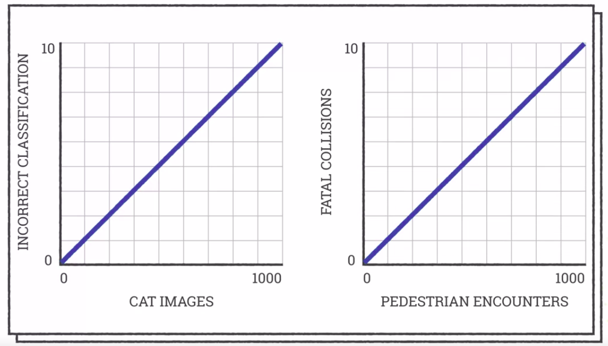

Machine Learning for All
========================

by University of London

# Module 3

#
## Title: Machine Learning in Practice

## Lesson 3.1 Testing

### Testing

* How do we know if machine learning has worked?
	* You probably already have discovered the results are often not what you expect or want
	* In fact, even when a machine learning model works well, it's almost never completely perfect
		* It will still make mistakes on occasion.
* Once your algorithm is finished learning, you can test it by classifying each item of the training data and see what percentage it gets right
	* But it can be hard to determine a good result
		* It can depend on your application
	* Classifying cat images correctly 99% of the time is really good, but a self-driving car that fails to see pedestrians even 1% of the time could be fatal
				

				  
				

* Sometimes it's worth looking at how well humans do in a task
	* If people can only classify an emotion in the face correctly 70% of the time, you probably can't expect machine learning to do much better
* In a medical test, it's probably better to be cautious and erroneously recognize the disease in a healthy patient than fail to spot it in an ill patient
* Classifying the training set well is good, but you really want your model to do well on new data
* Machine learning works by optimizing the model so that it performs well on the training data
	* That means it can learn all the details of the training data and do very well on it
		* but it probably won't do as well on new data that was not in the training set
	* This is why machine learning practitioners keep some data just for testing
		* This test data is not used during the training phase, so it's a fairer test than using the training data
		* The percentage of correct classifications on the test set will give a much better idea of how well your model will work in practice
				

				  
				

* You should typically split your data into a training set and a test set
	* The training set should be bigger so that you have enough data for your algorithm to learn effectively
	* A good split might be 4/5 training and 1/5 testing
* Testing is a really important part of machine learning
	* Professionals often use complex testing methods with multiple data sets
		* but splitting your data into train and test sets is a really good start.

## Lesson 3.2 Societal Impact of Machine Learning

### Problems with machine learning

* There are a lot of reasons why certain data sets do not work well for machine learning
	* The basic reason is that the machine learning algorithm is actually doing its job
		* It's learning what's in the training data set, but that isn't always what we wanted to learn and it doesn't always transfer over to the testing set or the real world
	* This is often because it learns aspects of the training set that are irrelevant to the task
* For Example
	* There was a classic example of a system that was trying to recognize tanks and did very well on the training set but completely fails in the real world
		* The developers realized that they had taken all of the pictures of the tanks on a cloudy day
		* The system learned the lighting conditions, not the tanks themselves
* There were some technical solutions to this type of problem, very complex models can learn every little detail of the training set and therefore lots of irrelevant details
	* That's why most machine learning practitioners favored using models that are as simple as possible while still being able to do the job
* When it comes to doing machine learning though, often the best thing you can do is make sure you have a good data set
* When collecting a data set, you have to check
	1. whether there's anything about how you are collecting the data that would not be true of the real world
	1. Are all the pictures against the same background, in the same lighting conditions, is the person you're trying to recognize always wearing a hat or glasses
	1. Do they have their hair tied back
	1. Are they always wearing the same makeup
* The more you can vary any of these things in your data set, the better
	* Try to capture images under as many conditions as possible
* Make sure that your training and test sets are as representative as possible of the data you will be getting in the real world, so that your model isn't surprised by a very different type of image
* In short, do everything you can to make sure your algorithm is learning what you want it to learn and can't cheat by using irrelevant features to make decisions
* What if once you've tested your model, it doesn't work as you'd expected?
	* you should really start looking at the examples that aren't classified correctly
	* Can you see any patterns in the mistakes the model is making?
	* Maybe you haven't got enough training examples that are similar to a particular example in your testing set
	* Maybe certain items in one class look similar to training examples in another class
* Most of the time you can fix problems by adding new training examples that show the learning algorithm the difference between two classes
	* For example
		* If you don't have any gray dogs in your training set and lots of gray cats, it might think that this is a cat
		* It should be quite easy to fix the problem. Go and find some pictures of gray dogs
				

				  
				

* Sometimes two classes might just be too hard to tell apart and you might need to rethink the problem a bit
	* Maybe limiting the set of classes or making sure your images are taken under more controlled conditions
				

				  
				

* The important thing is to spend a lot of time testing the model and when it goes wrong, look carefully at the data that's misclassified and do your best to improve the training set

## Lesson 3.2 Societal Impact of Machine Learning

### Applications of machine learning

* One of the most successful uses of machine learning concerns language both written text and speech
* The Google search engine relies very heavily on machine learning on the text of web pages to give you good results
* Machine learning has also enabled the current generation of automatic translation software, which is now very good because it's been trained on data sets of the same text translated into two or more languages
* The proceedings of the Canadian Parliament, which are available in both English and French, are an early example of a dataset that was used to train translation software
* One of the most impressive uses of machine learning on language has been speech recognition
	* Of the sort you can see an automatic assistance like Amazon Alexa or Apple Siri
* The fact that a computer can understand your question and come up with the correct answer is pretty astounding and it's all down to machine learning on large amounts of recorded voice data
* The product recommendation that sites like Amazon give you are chosen using machine learning
	* If Amazon's recommendation seem uncannily accurate, it's because it's learned from it's hundreds of millions of customers, and that's one of the characteristics of modern machine learning
* You've learned in this course that machine learning works better the more data you have
	* So the companies that can use it most effectively are those with the most data
	* Like Amazon with its millions of customers, Facebook with its billions of users, and Google with essentially the entire Internet
				

				  
				

* The vast amounts of data we're producing on the Internet are likely to feel new amazing breakthroughs that apply machine learning to new areas
	* Some of the ones that seem possible in the next few years include automatic medical diagnosis from radiology scans, and computers that can write news articles
		* Something that's already been done for sports and financial news
	* Self-driving cars are another machine learning innovation
		* One of the hardest things about self-driving cars is recognizing what's on the road around the car
		* Whether it's other cars, bicycles, pedestrians or road signs
		* This means that a large part of self-driving car technology concerns image recognition

### Dangers of machine learning

* A lot of people worried about the potential for artificial intelligence to be too successful
* The computers will become more intelligent than humans and will take over the world
	* This view is well expressed by Nick Bostrom in his book, Superintelligence
		* Like many thinkers in this area, he thinks there's a potential for an intelligence explosion
		* In which an AI, that is more intelligent than humans, will invent a more intelligent AI, which in turn will invent an even more intelligent AI and so on, until we have a vastly super intelligent computer that will take over the world
* Although super human artificial intelligence is possible eventually, this scenario is unlikely
	* Creating human level intelligence and beyond, we'll take a lot of work and these many conceptual breakthroughs
	* Simply having more memory or processing power which is what an AI is likely to bring, will not mean these problems can be solved instantly
* Pedro Domingos, machine learning professor and author of The Master Algorithm. One of the best books on machine learning for the general public
	* People worry that computers will get too smart and take over the world, but the real problem is that they're too stupid and have already taken over the world
* Machine learning is now being used in lots of very important roles and we should worry about the possible negative implications
* One of the most obvious effects of machine learning and AI is on jobs
	* If machine Learning Systems can do things that previously only humans could do, there's a risk that our jobs we taken over by machines
	* There's already evidence that this is happening as described by Martin Ford in his book, Rise of the Robots
* This can affect any kind of job from taxi drivers being replaced by self-driving cars, to doctors and lawyers being replaced by automatic diagnosis or legal case search
* We could end up in a situation of mass unemployment and poverty but we could also end up in the science fiction utopia in which we all have to work much less and benefit from all the work done for us by the machines
				

				  
				

* Job automation is about machine learning working well, but there were lots of problems due to machine learning not working as we want
	* A big issue is bias in machine learning models
		* We tend to think of computers as objective and unbiased but researchers like Kate Crawford have shown that machine learning models can show the same sort of bias that humans have
		* For example, machine Learning Systems used by banks can disproportionately refuse loans to certain ethnic groups
		* This is often called __algorithmic bias__, but the bias is not really in the algorithms
		* Machine learning algorithms do have one major bias
			* They aim to reproduce what they see in the data
			* That isn't really a bias
			* It's what the algorithm is supposed to do
		* One way of trying to eliminate bias is to ignore features such as race or gender
		* Unfortunately, it isn't that simple because other seemingly innocuous data features might be associated with race or gender
			* For example, clothes shopping habits can reveal gender. Postcodes might reveal race, if people from certain ethnic groups tend to live in different parts of a city
* One really important aspect of data is features
	* It's not only important which examples of data we use but the features we include about in each example
* Biased systems can be particularly dangerous if they're making important decisions about us
	* Like, machine Learning Systems being used to inform police work
	* But there are many others, machine Learning Systems now influence whether we get an insurance, a bank loan, or even a job
* Machine learning systems are being used in certain US school districts to decide which school teachers are under performing and which should be fired
* The dangers are enhanced by the fact that many machine learning methods like neural networks are very complex and hard to interpret
	* This means it's very hard to know why a model has made a certain decision
	* If we don't know why a decision was made, there's no way to appeal against it or to make the system work better
	* If people trust a model without checking how it works because they can't, we end up with important decisions being made about people that no one understands and that no one can know whether they were right or wrong

> __Question:__ What is the best way of eliminating bias in machine learning?\
__Answer:__ Have as many diverse people as possible involved in collecting data and training machine learning algorithms\
__Explanation:__ The more people that are involved the less likely that the biases of a small group of people will influence the machine learning systems. That's why we want as many people as possible to learn about machine learning.

