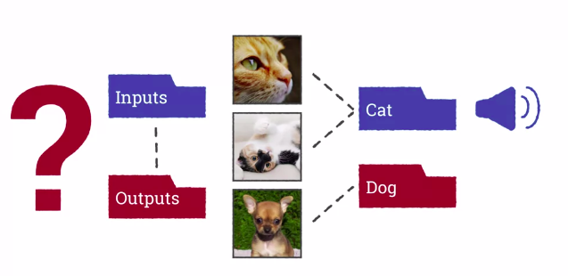
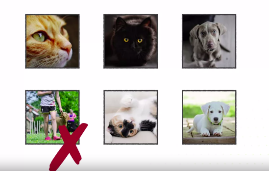

Machine Learning for All
========================

by University of London

# Module 4

#
## Title: Your Machine Learning Project

## Lesson 4.0 Introduction

### Introduction: Collecting your own dataset

* Machine Learning is about using example data to train a computer to do a task
* That means to do a Machine Learning project you need to collect data and train the model
* You need to think about what problem you want to solve in Machine Learning, and what data you could collect to help solve that problem
* You need to make sure your data accurately reflects the real world and it's enough for the Algorithm to learn a working model
* Any computing project you do is unlikely to work first time
	* So you'll need to test it and improve your model by collecting more data or finding the problem
* Collecting data, training, and testing are all important parts of the craft of Machine Learning
	* Something you can only learn by doing it in practice

## Lesson 4.1 Your machine learning project

### Collecting a dataset

* Collecting data to try to model solve a problem
* The first thing you need to do is decide what problem you're going to tackle
* A Machine Learning model maps inputs to outputs
* We've been using classification which means the outputs are one of a small set of categories
	* We can use these categories to do other things like playing sounds or showing images
		* For example playing meow when we recognize a cat
* But the model itself is just putting inputs into classes. So you need to decide what the classes are and which examples fit in each class
				

				  
				

* You also need to make sure that there's enough information in the inputs to work out their classes
* It can't be based on any contextual information which a human might know but it's not in the picture itself
* One important aspect of this for most Machine Learning is the features you're using
	* If the features do not contain the information needed to perform the task, the learning algorithms will not work
* Bear in mind that some features are hard to detect in images, like the size of an object
	* Just because something is photographed close up and takes up a large part of the image doesn't mean the object itself is big
* Once you've defined your problem you need to gather your datasets
	* Modern machine learning problems can require thousands or even millions of examples for each class
* More importantly, your examples should be as varied as possible
	* They should represent the whole range of the types of inputs you would get in the real world
* In particular, you should make sure there aren't any extraneous elements that are associated with the class
	* Like all items in the class being taken on the same background or in the same lighting conditions
* You should also have a test dataset
	* The test dataset should also be as close as possible for the data you expect in the real world
	* The best way to create a test dataset is to gather slightly larger set for training and then randomly choose some of your examples to be your test data
	* Make sure you don't use the same examples in your train and test set, otherwise it's not a fair test
* Once you have your data you can use it to train the model using our Machine Learning plugin
				

				  
				

	* You can then try out the model on the test set and see how many examples it gets right
	* If it works okay, that's good. But if it doesn't, you need to think about how to improve it
		* Look carefully at the examples that have been classified incorrectly
		* Try to imagine what training examples would help your algorithm classify them correctly
				

				  
				

* Getting Machine Learning to work can be a lot of effort
	* But if you spend enough time testing and gathering new data, you should be able to get a good model
				

				  
				

* Sometimes however, it will be simply impossible to get it working for the data you've chosen
	* In that case you might need to rethink your problem
* Sometimes you can come up with a set of classes that are just as useful in practice but much easier to recognize
	* Maybe you'll need your images to be taken under controlled lighting conditions, or you need to exclude certain difficult examples on the border line
				

				  
				

